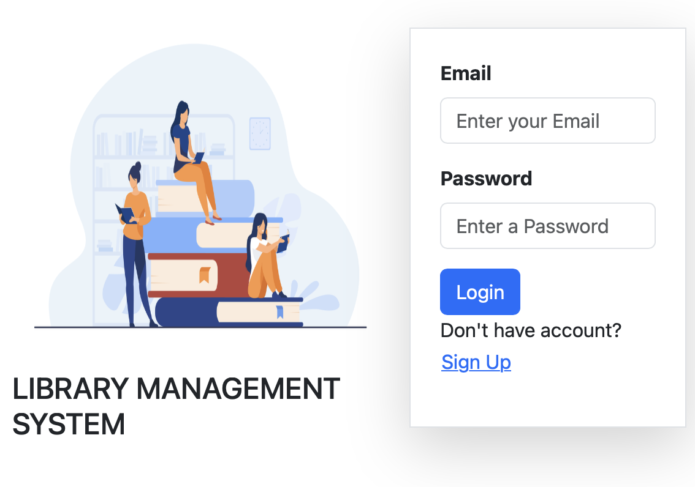
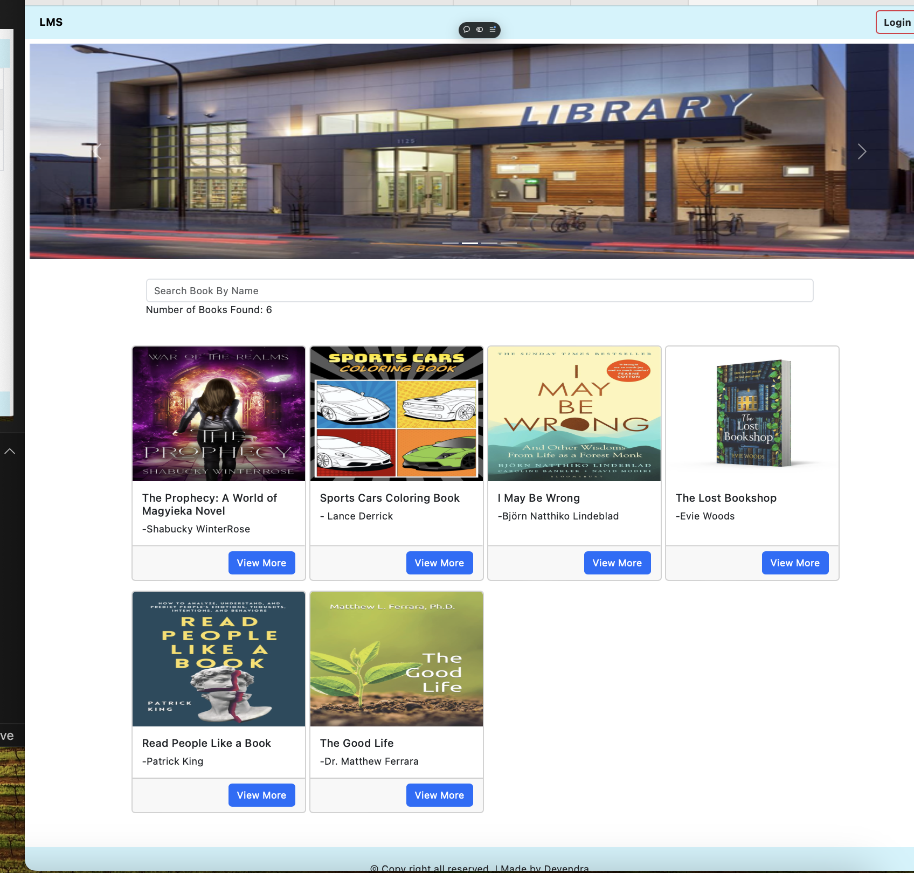
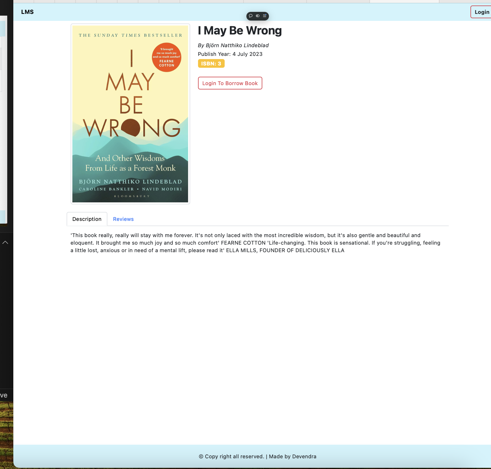

# Library Management System - Client

This is the frontend of the Library Management System (LMS) built using React, Redux, and other modern web technologies. The client interacts with a RESTful API to manage users, books, reviews, and burrow operations.

## Features

- User authentication (registration, login, logout)
- Book listing and detailed view
- Burrow and review management
- Admin panel for managing users, books, and reviews
- Private routes for client and admin roles
- Notifications using `react-toastify`

## Technologies Used

- React
- Redux Toolkit
- React Router DOM
- Bootstrap
- Axios
- Vite for fast builds and development

## Installation

Follow the steps below to set up the project locally:

1. Clone the repository:

   ```bash
   git clone https://github.com/Devendra-1997/library-client.git
   ```

2. Navigate to the project directory:

   ```bash
   cd library-client
   ```

3. Install the dependencies using Yarn:

   ```bash
   yarn install
   ```

4. Start the development server:

   ```bash
   yarn dev
   ```

## Scripts

- `yarn dev`: Starts the development server
- `yarn build`: Builds the project for production
- `yarn preview`: Previews the production build
- `yarn lint`: Runs ESLint for linting

## Project Structure

- `src/pages`: Contains the different page components (e.g., BookPage, HomePage, DashboardPage)
- `src/components`: Reusable components like layout and private routes
- `src/store`: Redux store configuration and slices
- `src/hooks`: Custom hooks for form handling, modals, and axios requests

## Demo

check the link below : https://library-client-kappa.vercel.app/






## Dependencies

- **React**: UI library, For building the user interface
- **Redux Toolkit**: State management, For managing global state
- **React Router DOM**: Routing library
- **Bootstrap**: CSS framework for responsive design
- **Axios**: HTTP client for making API requests
- **React Toastify**: For displaying notifications.
- **Recharts**: Charts for admin dashboard , For displaying data visualizations in the Admin Dashboard.

## Usage

**Admin Dashboard**:
Access the Admin Dashboard through /admin. Here, admins can manage books, burrow requests, reviews, and users.
**Client Side**:
Clients can browse available books, view book details, burrow books, and write reviews.
Clients must log in to manage their burrows and profiles.
**Authentication**:
User authentication and authorization are handled by the backend. Only authenticated users can access private routes such as /profile and /burrows.
**Admin Features**:
Admins can add new books, view and manage burrows, respond to reviews, and manage users.

## Deployment

To deploy the project, build the project using:

```bash
yarn build
```

## License

This project is licensed under the MIT License.
